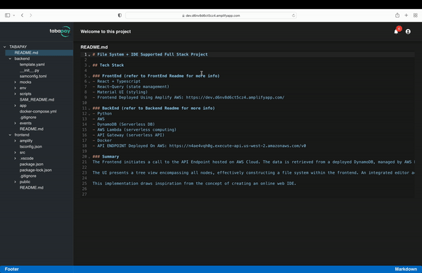

# File System + IDE Project (Full Stack Project)

## Deployed Link (using Amplify)

### https://dev.d6nv8d6ct5cz4.amplifyapp.com/

## Demo Gif


## Github Link

### https://github.com/dinhlam2000/tabapay

## Introduction

Greetings, and welcome to my comprehensive implementation showcasing the seamless integration of a file system with an integrated development environment (IDE). This presentation highlights various features, providing in-depth insights into the code structure and guidance on local deployment. For a live demonstration, please feel free to explore the deployed version on AWS [here](https://dev.d6nv8d6ct5cz4.amplifyapp.com/).

## BACKEND SERVER

```
API = https://n4ae4vqh0g.execute-api.us-west-2.amazonaws.com/v0
DEPLOYED API USING SAM CLI
```

## Description

This application incorporates reading a file system, in which the data of the file system is fetched from **Amazon DynamoDB**, using **AWS Lambda**, leveraging on the scalability and cost-efficient capabilities of AWS Lambda. Leveraging TypeScript for enhanced code clarity, Material-UI for polished styling, and react-query to perform powerful asynchronous state management for application, it offers a user-friendly interface with distinct components.

## Features Supported

- A tree-view representation of the File System
- Integrated Code Editor within the Application
- User-friendly layout theme

## Highlight

- The File System is dynamically fetched from an AWS Lambda-hosted server, leveraging serverless computing and supported by Amazon DynamoDB.
- **IDE SUPPORT**: The CodeEditor accommodates various file types, including javascript, typescript, python, markdown, json, css, scss, and yaml.
- **State Management**: Utilizing tanstack/react-query, the application excels in granular state management, allowing powerful asynchronous handling of states with support for promises and async/wait operations (https://tanstack.com/query/latest/)
- **ThemeProvider Integration**: Consistent styling across the application is maintained using ThemeProvider, offering a cohesive color palette (primary, secondary, info, warning, success).
- **Responsive Styling**: The application's styling adapts to various screen sizes, ensuring a responsive and user-friendly experience.
- **Extended Documentation (Readme)**: The addition of more informative pages, including an extended Readme, offering comprehensive insights into the application's functionality and usage.

### Future Expansion with Serverless Database Solution (DynamoDB) + AWS Lambda API

- **Save and Publish Code**: Enabling users to save code changes within the Code Editor and publish updates for persistent changes across visits.

- **Code Execution**: Enabling code execution within the IDE, allowing developers to run their code seamlessly.

- **Code Importing**: Facilitating the connection of the application to an open-source folder, automatically importing files for users to view and edit

- **Notification System**: Implementation of a robust notification system to alert users of any crucial messages or updates, fostering proactive engagement.

- **Extended Documentation (Readme)**: The addition of more informative pages, including an extended Readme, offering comprehensive insights into the application's functionality and usage.

- **GOAL**: Aspire to develop an Online Web IDE in the near future!

## To Deploy to AWS

- First follow this [link](https://docs.amplify.aws/cli/start/install/) to setup amplify cli

- then follow amplify host

```
source ~/.bash_profile

GATHER ACCESS KEY FOR AWS:
cat ~/.aws/credentials

amplify configure # only run one time to generate ~/.aws/credentials
amplify init # to build frontend project

amplify build # might need to amplify host first if have not hosted
amplify publish

```

This project was bootstrapped with [Create React App](https://github.com/facebook/create-react-app).

## Available Scripts

In the project directory, you can run:

### `npm start`

Runs the app in the development mode.\
Open [http://localhost:3000](http://localhost:3000) to view it in the browser.

The page will reload if you make edits.\
You will also see any lint errors in the console.

### `npm test`

Launches the test runner in the interactive watch mode.\
See the section about [running tests](https://facebook.github.io/create-react-app/docs/running-tests) for more information.

### `npm run build`

Builds the app for production to the `build` folder.\
It correctly bundles React in production mode and optimizes the build for the best performance.

The build is minified and the filenames include the hashes.\
Your app is ready to be deployed!

See the section about [deployment](https://facebook.github.io/create-react-app/docs/deployment) for more information.

### `npm run eject`

**Note: this is a one-way operation. Once you `eject`, you can’t go back!**

If you aren’t satisfied with the build tool and configuration choices, you can `eject` at any time. This command will remove the single build dependency from your project.

Instead, it will copy all the configuration files and the transitive dependencies (webpack, Babel, ESLint, etc) right into your project so you have full control over them. All of the commands except `eject` will still work, but they will point to the copied scripts so you can tweak them. At this point you’re on your own.

You don’t have to ever use `eject`. The curated feature set is suitable for small and middle deployments, and you shouldn’t feel obligated to use this feature. However we understand that this tool wouldn’t be useful if you couldn’t customize it when you are ready for it.

## Learn More

You can learn more in the [Create React App documentation](https://facebook.github.io/create-react-app/docs/getting-started).

To learn React, check out the [React documentation](https://reactjs.org/).
